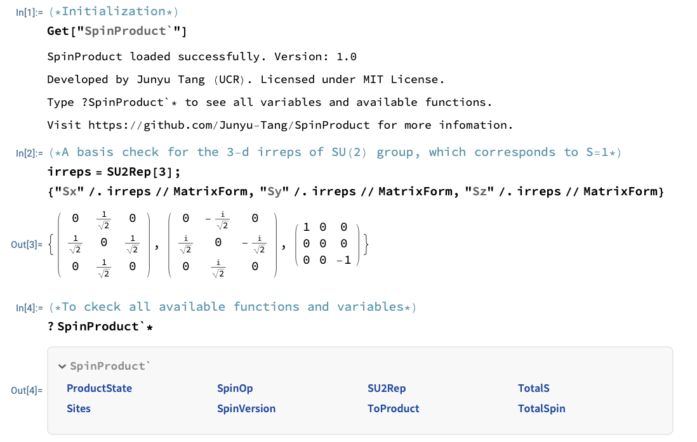

# SpinProduct
A Mathematica Paclet/Package for manipulation of spin product states in terms of matrix language.


## How it works?

The essential part of this Paclet is constructing the matrix representation for the spin operators and spin product states for arbitary spin sites with designed quantum spin number $S$. Thus, the action of spin operators on the product states is straightforward by doing a **matrix multiplication**. This Paclet also provides a function to translate the results to the product states written in Dirac ket notation. 


## Installation

Download and put the ```SpinProduct.wl``` file in the following path
```
Mathematica\Contents\AddOns\ExtracPackages
```
or somewhere your Mathematica could find ($Path).

To load the package:
```
Needs["SpinProduct`"]
```
or one use following command, which will reload the package (overwite the variables) every time being called

```Get["SpinProduct`"] ```

The above command should be equivalent with
```
<<"SpinProduct`"
```
After the package is sucessfully loaded, type ```?SpinProduct`* ``` to see all variables and available functions.


## Functions

 * ``` TotalSpin[listS_]```

 Add seversal quantum spin number $S$ (total spin number). The input ```listS``` is a list (vector) contains only positive integer or half integer (S = 1/2, 1, 3/2, 2, 5/2,...$). For three spin sites with spin-1/2 for all of the sites, one can use the input ```listS={1/2,1/2,1/2}```. Tips: Use 3/2 instead of 1.5 for the quantum spin number $S$. The length of input list is recorded to a variable ```Sites```, which can be directly called.
 <br/><br/>

 * ``` SU2Rep[N_]```

This function returns an association of the ```N```-dimensional irreducible representation (matrices) for three generators of SU(2) group. The dimension ```N``` must be an positive integer that is larger or equal to 2. In principle, one could use these matrices to construct any spin operators in the spin space. In the following, we provide a more convenient way by calling the ```SpinOp```` function
<br/><br/>

 * ``` SpinOp[i_, op_]```

This function returns a representation (matrix) of operator ```op``` at spin site ```i```. The output is constructed by direct product of identity matrices and the irreducible representation of the SU(2) group for spin at site $i$. The dimension of returned matrix is dim=N1xN2xN3... with Ni=2S(i)+1 the dimension of spin space for spin at site $i$. The valid input of operator ```op``` includes ```op="Sx", "Sy", "Sz", "Sp", "Sm", "S2"```, where "Sp" and "Sm" are the ladder operators defined as $S^+=S_x+iS_y$ and $S^-=S_x-iS_y$ respectively. The operator "S2" is defined as the square of total spin $S^2=S_x^2+S_y^2+S_z^2$. Before calling this function, one must first specify the quantum spin number $S$ at each spin site by calling ``` TotalSpin```.
 <br/><br/>

 * ``` ProductState[ListSz_]```

This function returns a representation (matrix) of the direct product state with specified $S_z$ at each spin site. The output is constructed by direct product of spin states at each site. Thus, the returned matrix is dim=N1xN2xN3... with Ni=2S(i)+1 the dimension of spin space for spin at site $i$. In our convention, the state is in the $S_z$ basis. For example, a state in $|S=1,S_z=-1\rangle$ is represented by a column vector $(0,0,1)^T$ while the state $|S=1,S_z=+1\rangle$ is represented by $(1,0,0)^T$. The input ```ListSz``` contains the quantum number $S_z$ at each site and must be a list with the same length as spin sites. In additional, the input must satisfies the constrain $-S(i)<= S_z(i) <= +S(i)$ at each spin site. Before calling this function, one must first specify the quantum spin number $S$ at each spin site by calling ``` TotalSpin```.
 <br/><br/>

 * ``` ToProduct[state_]```

This function translate the input column vector ```state``` of some state to the product states explicitly written in Dirac ket notation. The input must be in the column form ```state={{v1},{v2},{v3},...}```. Note that if the input can not be written as the product states (for example, the entangle state for triplet with $S_z=0$), then this function will throw an error.

 <br/><br/>

## Examples

In the following, I demonsate how my package can be applied to the spin singlet and triplet states, which are the most famous states for two spin sites. Note that, the package can also deal with the case of single spin. The mathematica notebook for the below examples can be found in the demo folder.


(1) We first load the package and check the irreps of SU(2) group. The available functions and variables can also be found by command ```?SpinProduct`*```:





(2) Then we construct a two spin sites with both $S=1/2$.


## Updates

* Version-1.0 2025/07/02
  
  First version of SpinProduct!
